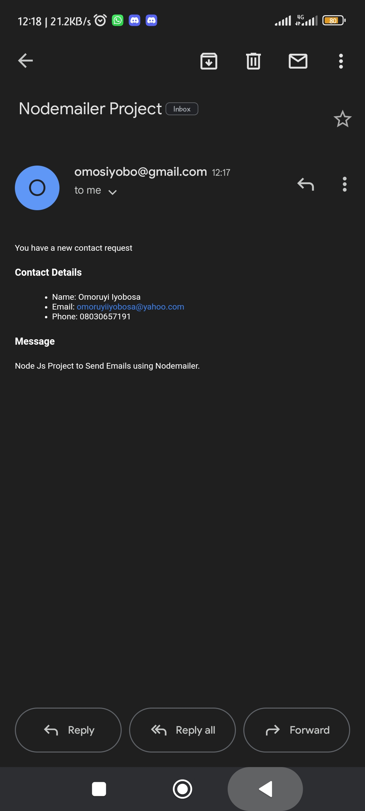
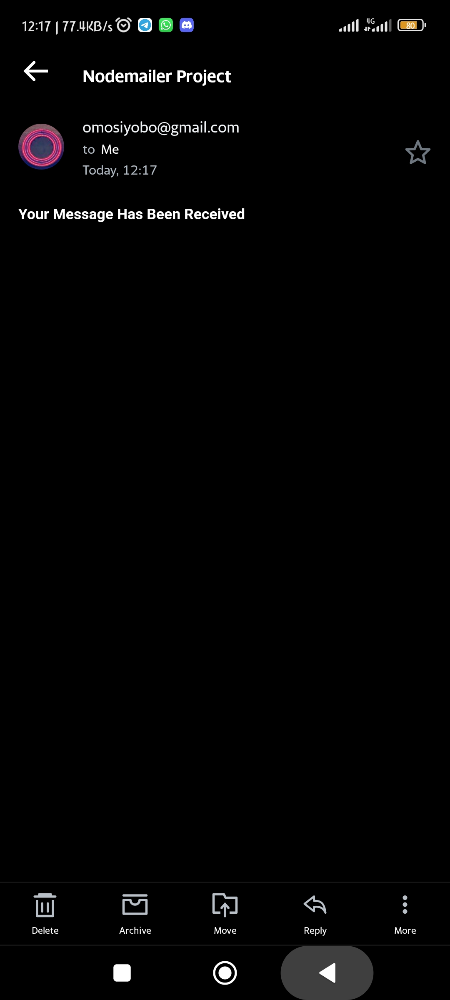

# nodemailer
Node Js Project to Send Emails using Nodemailer.

This project can be used on a Contact Form and will send the details entered on the form to the receiver email address once completed. 

It can send to the website owner email to show new contacts and to the website user email to show that their contacts have been added.

